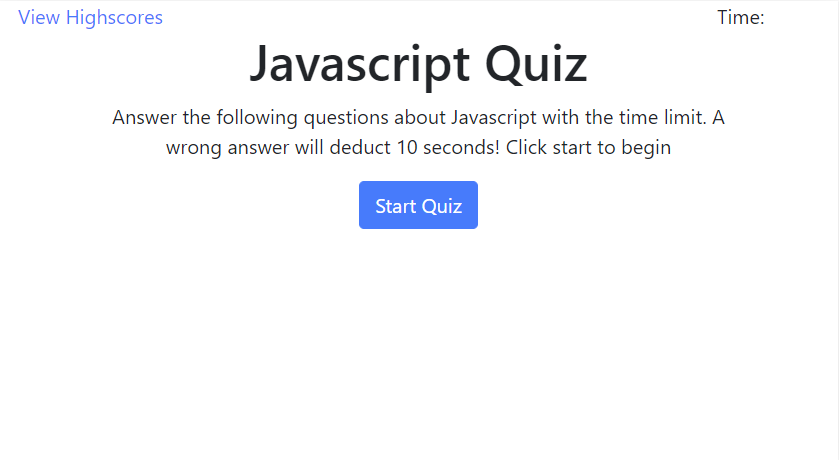
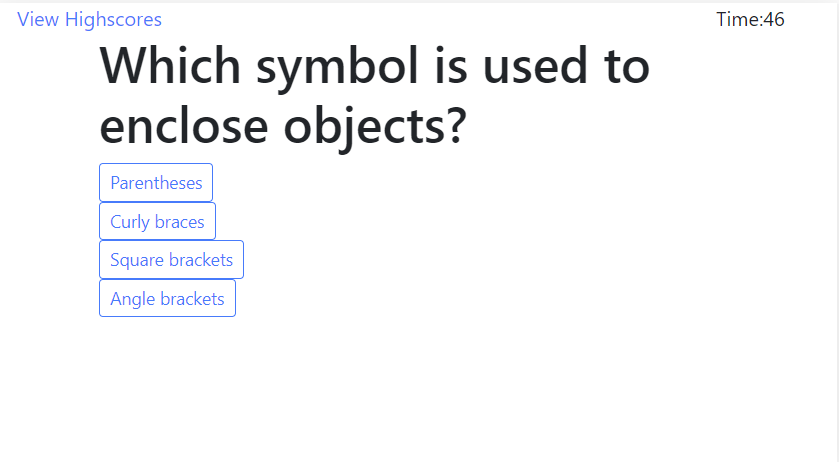

# Quiz-Framework

A framework for multiple-choice quizzes. Created to assist with quizzing myself and friends on various topics. Currently contains a Javascript quiz.

This project is an exercise in using jQuery to manipulate the DOM to hide and show elements on a single page, as well as in utilizing local- and session-storage.

## Usage

#### Setup

Currently, a quiz must be defined as a JavaScript object within the quizOptions.js. Two quizzes exist there as examples.

The quiz to be run must be passed to loadQuiz at the end of the same file.

The quiz timer is set in script.js.

#### Taking a Quiz

Clicking the "Start Quiz" button will start the timer and load the first question.

Click any of the buttons below the question to answer. Clicking a button will move to the next question and alert you whether the answer you gave was correct.

Incorrect answers will reduce the timer by 10 seconds.

## Links

[Project GitHub repository](https://github.com/Athear/Quiz-Framework)

[Live project link](https://athear.github.io/Quiz-Framework/)